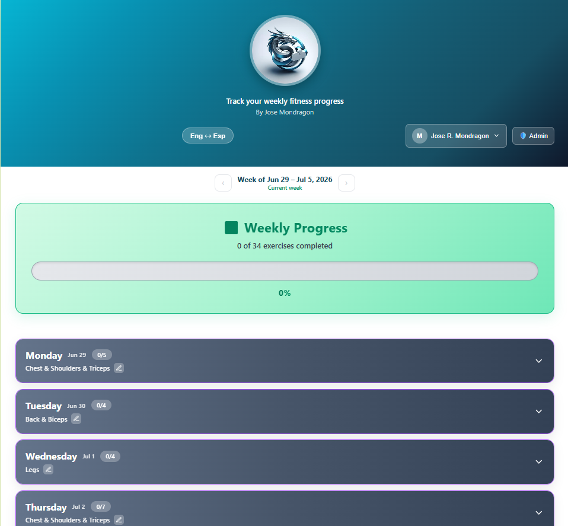
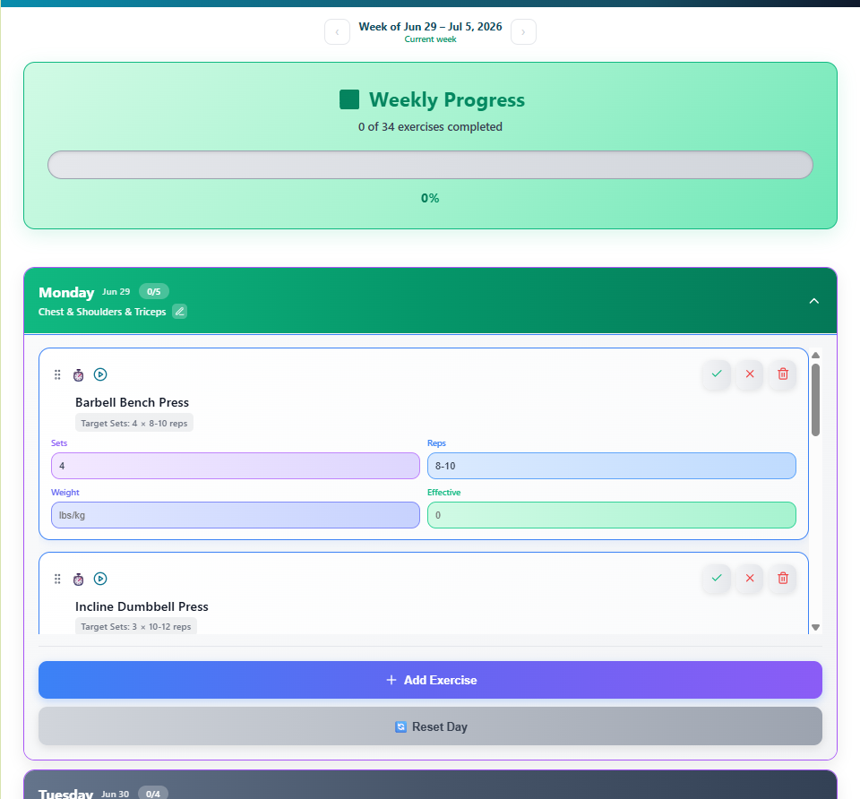
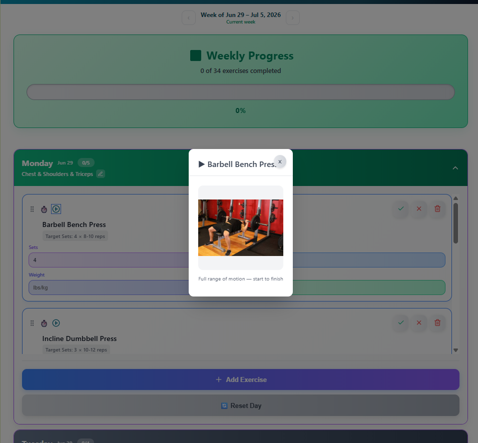

# 🏋️‍♂️ Gym Tracker App

A modern, responsive React-based gym workout tracking application that helps you plan, track, and manage your weekly fitness routine with a complete Push/Pull/Leg split workout system. Sign in to sync your workouts across devices, or use it offline — it works either way.

🔗 **Live app:** [gymworkoutjm.vercel.app](https://gymworkoutjm.vercel.app)

## Screenshots

| Weekly dashboard | Day editor & demos | Exercise demonstration |
|:---:|:---:|:---:|
|  |  |  |
| Dragon-logo header, EN/ES toggle, week navigator with dates, and the weekly progress bar. | Edit sets, reps, weight and completion; add, reorder, or reset exercises. | Tap ▶ on any exercise for a start-to-finish demonstration of the movement. |

## Features

### Core Functionality
- **Weekly Workout Planning**: Pre-loaded 6-day Push/Pull/Leg split with comprehensive exercises
- **Smart Exercise System**: 
  - **Strength Training**: Traditional sets, reps, and weight tracking
  - **Cardio Exercises**: Time-based tracking (1-120 minutes) instead of sets/reps
- **Advanced Exercise Library**: 200+ exercises categorized by muscle groups
- **Universal Search**: Search exercises across all muscle groups with real-time filtering
- **Custom Exercise Creation**: Add your own exercises with flexible sets/reps configuration
- **Multi-Muscle Group Selection**: Select up to 3 muscle groups per day with intelligent UI

### Progress & Tracking
- **Visual Progress Bar**: Real-time weekly completion tracking
- **Interactive Exercise Management**: 
  - Mark exercises as completed, skipped, or incomplete
  - Live editing of sets, reps, weight, and completion status
  - Drag and drop exercise reordering
- **Intelligent Exercise Display**: Context-aware UI that adapts to exercise type
- **Persistent Storage**: Workout data saved automatically — to the cloud when signed in, to local storage otherwise

### Accounts & Cloud Sync
- **Email/Password Authentication**: Secure sign up and sign in powered by Supabase
- **Cross-Device Sync**: Signed-in workouts are stored in the cloud and follow you to any device
- **Offline Fallback**: Not signed in? Everything still works and saves to local storage, then migrates to the cloud on your first sign-in
- **Password Recovery**: Full "forgot password" flow with an emailed reset link
- **Admin Dashboard**: Admins can list users, manage roles, and view or edit any user's workout plan (access enforced server-side by Postgres Row Level Security)

### Weekly History & Dates
- **Dated Weeks**: Every week is stamped with its date range and each day shows its calendar date
- **Week Navigator**: Step back through past weeks; finished weeks are kept read-only
- **Carry-Forward**: Starting a new week keeps your exercises and weights and resets completion, so progressive overload is one tap

### Exercise Demonstrations
- **How-To Guides**: Tap ▶ on an exercise for a start-to-finish demonstration of the movement's full range of motion
- **122 Exercises Covered**: Self-hosted on Supabase Storage with a graceful fallback when a demo isn't available

### Bilingual Interface
- **English / Spanish**: Full UI translation with an in-app language toggle

### Modern Design & UX
- **Professional Branding**: Custom logo integration with vibrant teal gradient design
- **Responsive Mobile-First Design**: Optimized for all screen sizes
- **Compact Layout**: Space-efficient design for maximum content visibility
- **Intuitive UI**: Color-coded muscle groups and status indicators
- **Search Highlighting**: Visual search term highlighting in exercise names

### Customization & Flexibility
- **Dynamic Muscle Group Assignment**: Change any day's focus with dropdown selection
- **Custom Default Settings**: Set preferred sets (1-10) and reps (1-20) for exercises
- **Exercise Type Detection**: Automatic detection and handling of cardio vs strength exercises
- **Reset Options**: Reset individual days or entire weeks
- **Workout Templates**: Pre-configured Push/Pull/Leg split with 20+ exercises

## Getting Started

### Prerequisites

- Node.js (version 18 or higher)
- npm package manager
- A [Supabase](https://supabase.com) project (free tier is fine) for auth and cloud sync — optional for offline-only local development

### Installation

1. **Clone the repository**
   ```bash
   git clone <repository-url>
   cd gym-tracker-react
   ```

2. **Install dependencies**
   ```bash
   npm install
   ```

3. **Configure environment variables**

   Copy `.env.example` to `.env` and fill in your Supabase credentials (Supabase dashboard → Settings → API):
   ```bash
   cp .env.example .env
   ```
   ```
   VITE_SUPABASE_URL=https://your-project-ref.supabase.co
   VITE_SUPABASE_ANON_KEY=your-anon-public-key
   ```
   The `anon` key is the public key and is safe to ship in the client — access is enforced by Row Level Security. Without these, auth and cloud sync are disabled but the app still runs offline against local storage.

4. **Set up the database**

   In the Supabase SQL editor, run `supabase/schema.sql`, then `supabase/admin.sql`. See [`SUPABASE_SETUP.md`](SUPABASE_SETUP.md) for the full walkthrough, including how to promote your account to admin.

5. **Start the development server**
   ```bash
   npm run dev
   ```

6. **Open your browser** and navigate to `http://localhost:5173`

### Build for Production

```bash
npm run build
```

The built files will be available in the `dist/` directory.

## Project Structure

```
src/
├── components/          # React components
│   ├── AddExerciseModal.jsx    # Exercise picker with search & filtering
│   ├── AdminDashboard.jsx      # Admin: user list, roles, edit any plan (lazy-loaded)
│   ├── AuthWrapper.jsx         # Gates the app on auth; routes sign-in/up/forgot
│   ├── DayAccordion.jsx        # Day workout with muscle group selection
│   ├── ExerciseItem.jsx        # Smart exercise item (cardio/strength)
│   ├── FeedbackModal.jsx       # Feedback form (lazy-loaded)
│   ├── LanguageToggle.jsx      # English/Spanish switch
│   ├── ProgressBar.jsx         # Weekly progress visualization
│   ├── UserProfile.jsx         # Header account dropdown + sign out
│   └── ui/                     # Reusable Button, Input, Modal primitives
├── pages/              # Full-screen auth pages
│   ├── SignIn.jsx / SignUp.jsx
│   ├── ForgotPassword.jsx      # Sends the reset email
│   └── UpdatePassword.jsx      # Set a new password after the reset link
├── contexts/           # React context providers (auth, language)
├── hooks/              # useAuth, useLanguage, useModal, useWorkoutPlan
├── services/           # Business logic
│   ├── workoutService.js       # Push/Pull/Leg plan data & operations
│   ├── ExerciseService.js      # Exercise creation, search, stats
│   ├── ExerciseTypeStrategies.js  # Strategy pattern for cardio vs strength
│   ├── StorageService.js       # Local storage adapter
│   ├── SupabaseStorageService.js  # Cloud storage adapter
│   └── AdminService.js         # Cross-user admin operations
├── lib/
│   └── supabase.js             # Shared Supabase client
├── translations/       # English/Spanish UI and exercise strings
├── constants/          # 200+ exercises, muscle groups, days
├── utils/              # dateHelper and other helpers
├── test/               # Vitest setup
├── App.jsx             # Main application + provider tree
├── main.jsx            # Application entry point
└── index.css           # Global styles

supabase/
├── schema.sql          # Tables (workout_plans, user_preferences) + RLS
└── admin.sql           # profiles, roles, is_admin(), admin policies
```

### Available Scripts

```bash
npm run dev       # Start the dev server
npm run build     # Production build to dist/
npm run preview   # Preview the production build locally
npm run lint      # Run ESLint
npm test          # Run the Vitest suite in watch mode
npm run test:run  # Run the Vitest suite once (76 tests)
```

## Usage Guide

### Workout System

The app comes pre-loaded with a complete **6-day Push/Pull/Leg split**:

- **Monday & Thursday**: Push Day (Chest, Shoulders, Triceps)
- **Tuesday & Friday**: Pull Day (Back, Biceps)  
- **Wednesday & Saturday**: Leg Day (Legs, Calves)
- **Sunday**: Rest Day

### Adding Exercises

#### From Exercise Library
1. Click "Add Exercise" button
2. **Search by name**: Type any exercise name for instant filtering
3. **Filter by muscle group**: Select specific muscle groups or "All"
4. **Set defaults**: Configure default sets (1-10) and reps (1-20)
5. **Cardio exercises**: Automatically show duration selector (1-120 minutes)

#### Custom Exercises
1. Switch to "Custom" tab
2. Enter exercise name, sets, and reps
3. Exercise will be added with your specifications

### Exercise Management

#### Strength Training Exercises
- **Sets**: Editable field for target sets
- **Reps**: Editable field for target rep range
- **Weight**: Track weight used (lbs/kg)
- **Done**: Mark completed sets

#### Cardio Exercises
- **Duration**: Select target time (1-120 minutes)
- **Completed**: Track actual time completed
- **No weight tracking**: Clean, time-focused interface

### Customization Options

#### Muscle Group Selection
- Click the edit icon (✏️) next to any day's muscle group
- Select up to 3 individual muscle groups
- Options include: Chest, Back, Shoulders, Biceps, Triceps, Forearms, Legs, Abs, Cardio
- Special "Rest" option for recovery days

#### Default Exercise Settings
- **Sets**: Choose 1-10 sets as default for new exercises
- **Reps**: Set min and max rep ranges (1-20 each)
- **Live preview**: See how exercises will appear before adding

### Progress Tracking

- **Visual progress bar**: Shows completion percentage for the week
- **Exercise counter**: Displays completed vs total exercises
- **Status indicators**: ✅ Completed, ⏭️ Skipped, ⏱️ Incomplete
- **Real-time updates**: Progress updates instantly as you mark exercises

## Technical Details

### Technologies Used

- **React 19**: Modern React with hooks and latest features
- **Vite**: Lightning-fast build tool and development server
- **Supabase**: Authentication and Postgres cloud database with Row Level Security
- **@dnd-kit**: Accessible, touch-friendly drag-and-drop for exercise reordering
- **vite-plugin-pwa**: Installable, offline-capable Progressive Web App
- **Vitest + Testing Library**: 76-test suite across services, hooks, and components
- **Inline Styles**: Component-scoped styling for better maintainability
- **Lucide React**: Beautiful, consistent icon library
- **Modern JavaScript**: ES6+ features and best practices

### Key Improvements

#### Enhanced Exercise System
- **Smart exercise detection**: Automatically identifies cardio vs strength exercises
- **Context-aware UI**: Different interfaces for different exercise types
- **Comprehensive database**: 200+ exercises across 10 muscle groups
- **Advanced search**: Real-time filtering with search term highlighting

#### Improved User Experience
- **Mobile optimization**: Touch-friendly controls and responsive design
- **Compact layouts**: Reduced spacing for better content density
- **Visual feedback**: Hover effects, color coding, and status indicators
- **Professional design**: Custom logo integration with cohesive branding

#### Technical Enhancements
- **Modular architecture**: Clean separation of concerns
- **Type safety**: JSDoc type definitions for better development experience
- **Performance optimized**: Efficient rendering and state management
- **Cross-browser compatibility**: Tested across modern browsers

### Data Structure

```javascript
// Exercise data structure
{
  id: string,              // Unique identifier
  dbId: number|null,       // Database ID (null for custom exercises)
  name: string,            // Exercise name
  sets: string,            // Target sets OR duration for cardio
  reps: string,            // Target reps (empty for cardio)
  weight: string,          // Weight used (empty for cardio)
  effectiveSets: string,   // Completed sets OR minutes for cardio
  status: 'incomplete' | 'completed' | 'skipped'
}

// Muscle group support
muscleGroups: [
  'Rest', 'Chest', 'Back', 'Shoulders', 'Biceps', 
  'Triceps', 'Forearms', 'Legs', 'Abs', 'Cardio'
]
```

## Mobile Support

The application is fully responsive and includes:
- **Touch-optimized**: Large touch targets and gesture support
- **Mobile-first design**: Optimized layouts for small screens
- **Compact interface**: Efficient use of screen real estate
- **Swipe gestures**: Natural mobile interactions
- **Responsive grids**: Adaptive layouts for all screen sizes

## Design Features

### Visual Branding
- **Custom logo integration**: Professional MD logo with teal color scheme
- **Gradient design**: Vibrant teal-to-dark gradient header
- **Clean typography**: Modern, readable font choices
- **Color-coded system**: Different colors for different muscle groups

### User Interface
- **Intuitive navigation**: Clear visual hierarchy and organization
- **Status indicators**: Easy-to-understand progress markers
- **Smart layouts**: Context-aware interface adaptations
- **Accessibility**: High contrast and clear visual feedback

## Deployment

### Build and Deploy

1. **Build the project**
   ```bash
   npm run build
   ```

2. **Deploy the `dist/` folder** to your hosting provider:
   - Netlify
   - Vercel
   - GitHub Pages
   - Any static hosting service

The production app is deployed on **Vercel** at [gymworkoutjm.vercel.app](https://gymworkoutjm.vercel.app). Remember that Vite bakes environment variables in at build time, so set `VITE_SUPABASE_URL` and `VITE_SUPABASE_ANON_KEY` in your hosting provider's environment settings and redeploy after any change.

### Environment Considerations

- **Serverless backend**: Supabase provides auth and the Postgres database — no server to run yourself
- **Cloud sync**: Signed-in workouts sync across devices; access is scoped per-user by Row Level Security
- **Offline capable**: Works without an account or connection, saving to local storage and migrating to the cloud on sign-in
- **Installable PWA**: Can be added to a home screen and launched like a native app

## Contributing

1. Fork the repository
2. Create a feature branch (`git checkout -b feature/amazing-feature`)
3. Commit your changes (`git commit -m 'Add amazing feature'`)
4. Push to the branch (`git push origin feature/amazing-feature`)
5. Open a Pull Request

## License

This project is open source and available under the [MIT License](LICENSE).

## Roadmap

### Recently Shipped
- [x] **Cloud synchronization**: Sign in to sync workouts across devices (Supabase)
- [x] **User accounts & auth**: Email/password sign up, sign in, and password recovery
- [x] **Admin dashboard**: User and role management with server-side RLS enforcement
- [x] **Bilingual UI**: Full English/Spanish translation with a language toggle
- [x] **PWA support**: Offline functionality and home-screen installation
- [x] **Weekly history & dates**: Dated weeks with a navigator and carry-forward on a new week
- [x] **Exercise demonstrations**: Start-to-finish how-to images for 122 exercises, self-hosted on Supabase

### Planned Features
- [ ] **Workout analytics**: Progress charts and performance metrics
- [ ] **Animated demos**: Upgrade the exercise how-tos from stills to looping video/GIF
- [ ] **Social features**: Share workouts and progress
- [ ] **Advanced templates**: More workout split options
- [ ] **Timer integration**: Rest timers and workout timing
- [ ] **Export functionality**: Export workouts to PDF/CSV
- [ ] **Nutrition tracking**: Basic meal and calorie logging
- [ ] **Achievement system**: Workout milestones and badges

### Technical Improvements
- [ ] **Data export/import**: Backup and restore functionality
- [ ] **Theme customization**: Dark mode and color themes
- [ ] **Advanced search**: Exercise filtering by equipment, difficulty
- [ ] **Performance optimization**: Virtual scrolling for large lists


**Built by Jose Mondragon**
